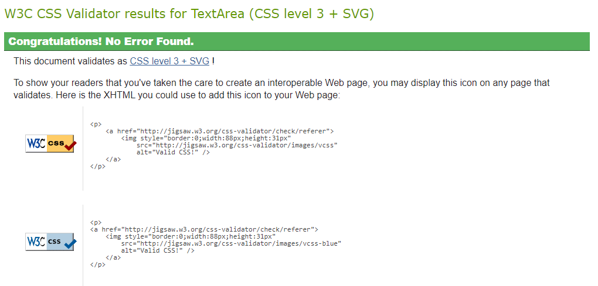

# EliteTechPC - Testing

Here is the documentation containing all the testing carried out in this project.

## Testing Contents ##

* [Manual Testing](#automated-testing)
* [Validators](#automated-testing)
    * [CI Python Linter](#automated-testing)
    * [W3C CSS Validator](#automated-testing)
    * [W3C HTML Validator](#automated-testing)
    * [Lighthouse](#automated-testing)
* [Bugs / Issues](#automated-testing)

## Manual Testing ##

Here I have completed manual testing of the sites functions and accessing certain points as a user and non-user. 

## Validators ## 

### W3C HTML Validations ### 

### W3C CSS Validations ### 

Base.CSS Validation Result : 

Checkout.CSS Validation Result :

