# EliteTechPC - Testing

Here is the documentation containing all the testing carried out in this project.

## Testing Contents ##

* [Manual Testing](#manual-testing)
    * [Navbar](#navbar--screenshot)
    * [Auth](#auth--screenshot)
    * [Bag](#bag--screenshot)
    * [Checkout](#checkout--screenshot)
    * [Profile](#profile--screenshot)
    * [Admin](#admin--screenshot)
    * [Products](#products--screenshot)
    * [Footer](#footer--screenshot)
    * [Home Page](#home-page--screenshot)
    * [Contact Us](#navbar--screenshot)
* [Validators](#automated-testing)
    * [CI Python Linter](#ci-python-linter)
    * [W3C CSS Validator](#w3c-css-validations)
    * [W3C HTML Validator](#w3c-html-validations)
    * [Lighthouse](#lighthouse-tests)
    * [WAVE](#wave)
* [Bugs / Issues](#bugs--issues)

## Manual Testing ##

Here I have completed manual testing of the sites functions and accessing certain points as a user and non-user. 
I will attach the test that were done and tested by me to as much extent as I could every point of the page.

## Navbar : 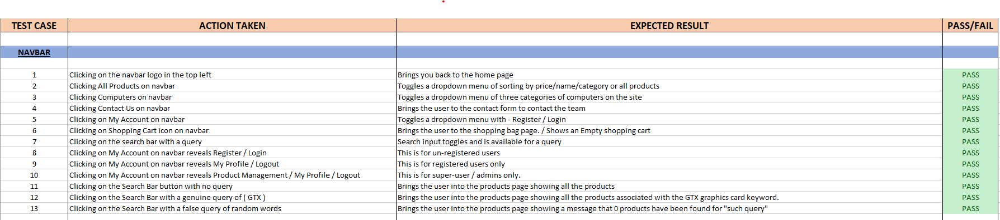

## Auth : 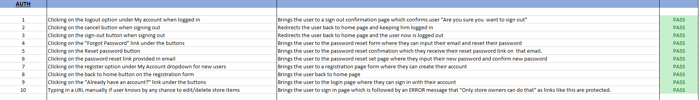

## Bag : 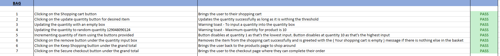

## Checkout : 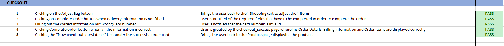

## Profile : 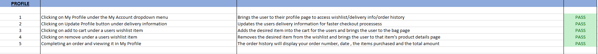

## Admin : 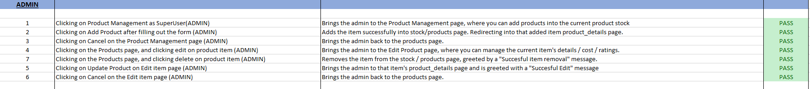

## Products : 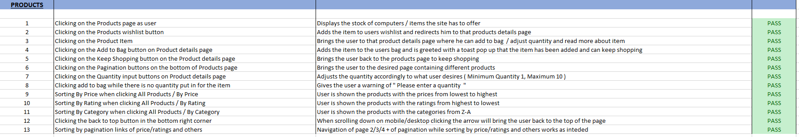

## Footer : 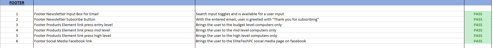

## Home Page : 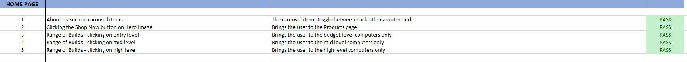

## Contact Us : 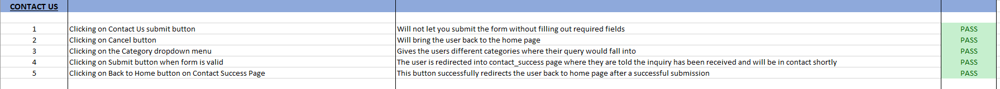

## Validators ## 

### W3C HTML Validations ### 

1. Home Page Validation Result : 
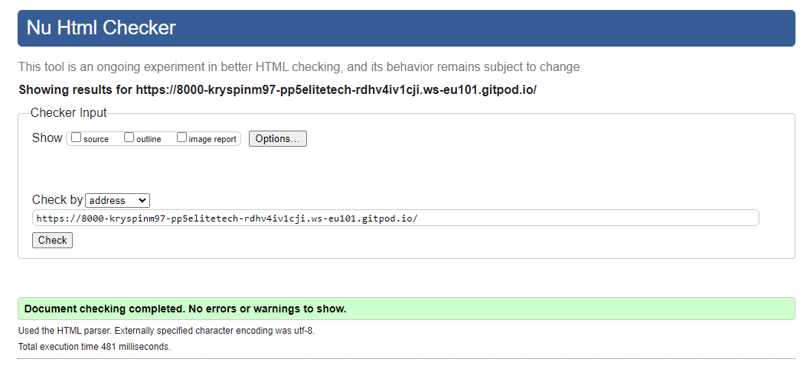

2. Products Page Validation Result : 
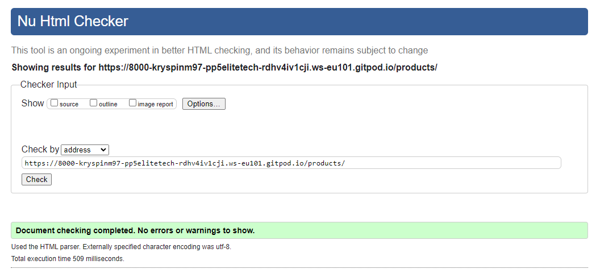

3. Products Details Validation Result : 
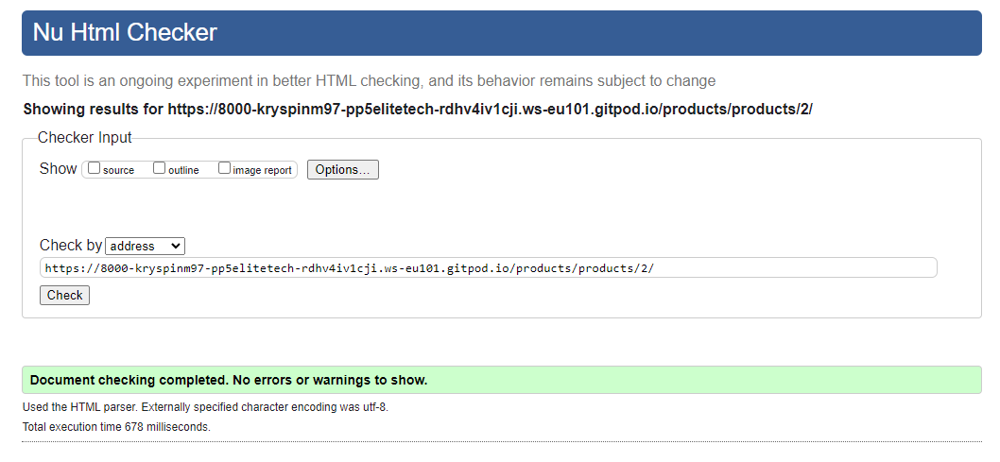

4. Bag Page Validation Result : 
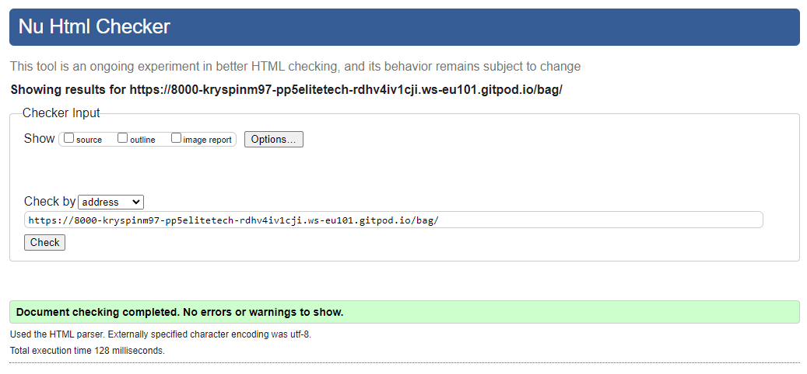

5. Accounts Signup Page Validation Result : 
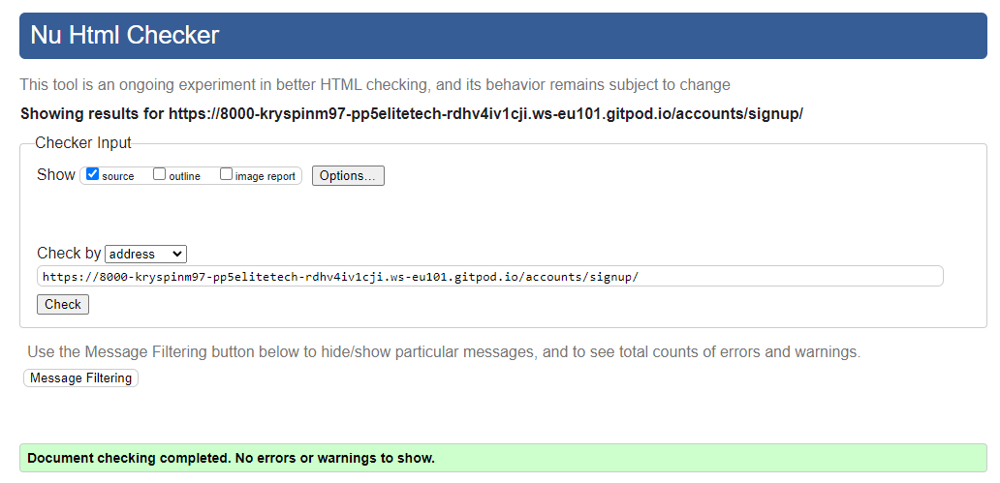

6. Accounts Login Page Validation Result : 
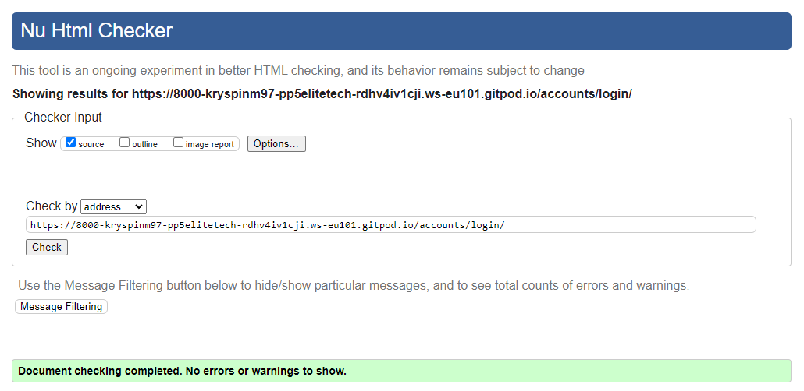

7. Password Reset Page Validation Result : 
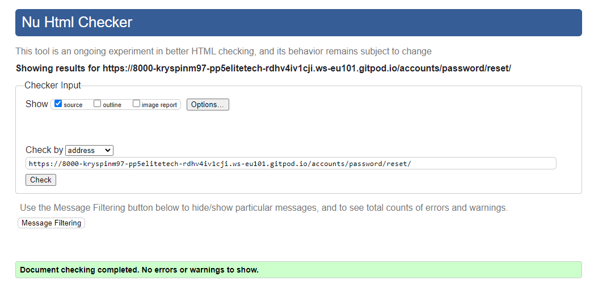

### W3C CSS Validations ### 

1. Base.CSS Validation Result : 
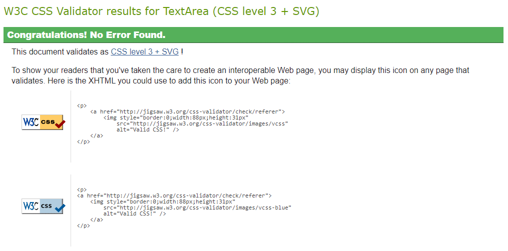

2. Checkout.CSS Validation Result :

## CI Python Linter ##

* Code Institue Python linter, all these files were put through the tester and nothing of major came up. Here are the results :

## Lighthouse Tests ##

I have completed a series of lighthouse tests for the performance of the site and other aspects.

### Home Page Desktop : 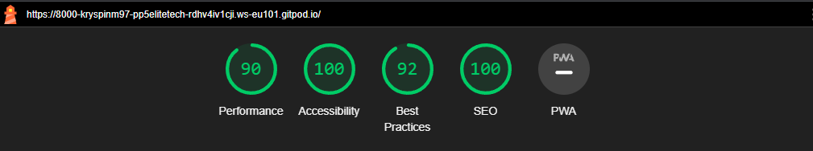

### Products Page Desktop : 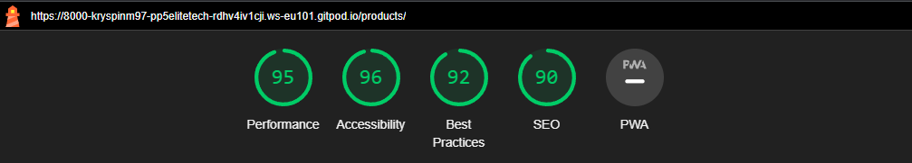

### Products Details Page Desktop : 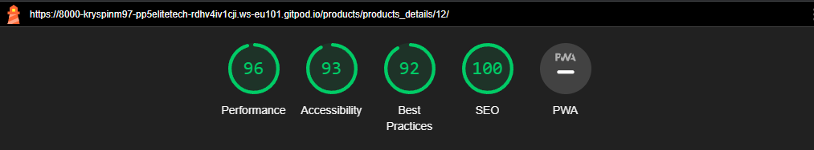

### Contact Us Page Desktop : 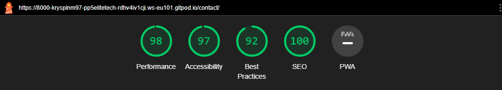

### Shopping Cart Page Desktop : 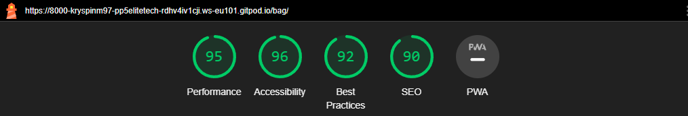

### Checkout Page Desktop : 

### Checkout Page Mobile : 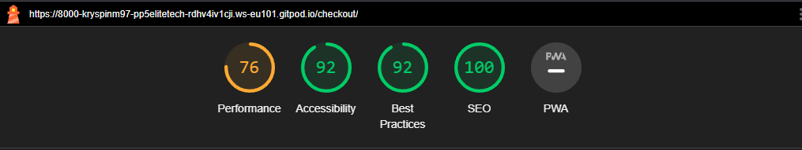

* From these tests I can see that performance wise the website could be initially improved, most likely it is due to image sizing/formats. I think with further optimizations the website can achieve fantastic results here.

## WAVE ##

I have also put the website through the WAVE accessibility testing with the following results :

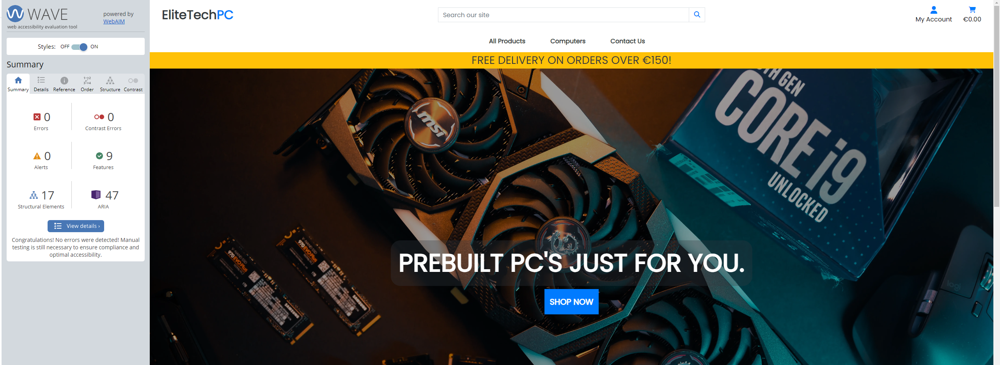

## Website Responsiveness ##

The website has been developed to the most extent by the Front-End Library called Bootstrap. It is an amazing help towards front-end development that has a ton of features that help with the alignment of content around the website.
I have tested the website on multiple devices and it works great.
I have used the Chrome Development tools to adjust things accordingly to suit as much devices as possible.

## Bugs / Issues ##

Here I document any known to me or to anyone else that spots any bugs or issues currently going on with the site. 

1. On specially small screen sizes the text from the dropdown menu from My Account navbar , overflows off screen as it is "too long" , which really is just a visual issue.

